# Analysis of Network Robustness, Validation Optimization, and Feature Perturbation

Deep learning models typically perform well on clean datasets but often struggle with out-of-distribution (OOD) shifts or corrupted images. This project evaluates different neural network architectures on standard datasets (CIFAR-10, Fashion-MNIST, ImageNet-100) under varied image corruptions. It examines how introducing perturbations into the validation set or internal network layers impacts classification accuracy, decision boundaries, and topological feature representations.

## 📂 Project Structure
```text
├── src/
│   ├── data_loader.py            # Custom Loaders for CIFAR10, F-MNIST, ImageNet-100 (80/20 split)
│   ├── train_baseline.py         # Standard network training scripts (VGG, ResNet, ConvNeXT, ViT)
│   ├── evaluate_models.py        # Validates model performance under OOD synthetic image corruptions
│   ├── experiment_a.py           # MLP validated against a standard clean distribution
│   ├── experiment_b.py           # MLP validated against focused Gaussian Noise distribution
│   ├── experiment_feature_perturb.py # Feature mapping robustness via intra-layer noise injection
│   ├── visualize_boundaries.py   # Decision boundary visualization using Inverse PCA
│   └── visualize_tsne.py         # Topological feature representation maps using t-SNE
├── notebooks/
│   └── main.ipynb                # End-to-end interactive exploration notebook
├── scripts/
│   ├── run_all.sh                # Automation script 
│   └── test_run.sh               
├── results/plots/                # Output analysis graphs & training maps
└── requirements.txt              # Python dependencies
```

## 🚀 Setup Instructions
1. **Clone the Repository:**
   ```bash
   git clone https://github.com/Vnshiee/Neural-Network-Robustness-Analysis.git
   cd Neural-Network-Robustness-Analysis
   ```
2. **Install Dependencies:**
   ```bash
   pip install -r requirements.txt
   ```
3. **Data Setup:** Run `hf_local_downloader.py` or `download_imagenet.py`. Datasets download securely into `data/`.

## ⚙️ Methodology & Analysis Workflow

The experiments were executed using an automation script `run_all.sh` across NVIDIA A100 setups. 
1. **Phase 1 (Data Processing):** An exact 80/20 train/validation split with fixed seed to prevent data leakage.
2. **Phase 2 (Baseline Architectures):** Validating behavior directly across CNN variants (VGG, ResNet, ConvNeXT) and Vision Transformers (ViT).
3. **Phase 3 (Validation Protocol Optimization):** Exploring MLP checkpointing strictly evaluated against Clean distributions (Exp A), Corrupted/Gaussian Noise distributions (Exp B), and dynamically optimizing random sequential noise. 
4. **Phase 4 (Visualizing Decision Boundaries):** Inverse PCA + t-SNE representations.
5. **Phase 5 (Internal Feature Perturbation):** Gaussian testing dynamically applied at inference step to early, middle, and late tensor parameters.

---

## 📊 1. Baseline Architectures & OOD Generalization
Across all configurations, **ResNet** established huge leaps in early representation caching yielding sharp performance accuracy on training datasets (`~88% on CIFAR-10, ~95% F-MNIST`), but quickly succumbed to overfitting traps against unmodified validation data. Conversely, **Vision Transformers (ViT)** scaled very cleanly across epochs, actively resisting out-of-bounds parameter diverging using its global-attention design, establishing a smoother tracking pattern despite requiring longer cycles to peak natively. 

### Selected Baseline Curves (CIFAR10)
| Model | Training Curves |
|-------|-----------------|
| **ResNet** | 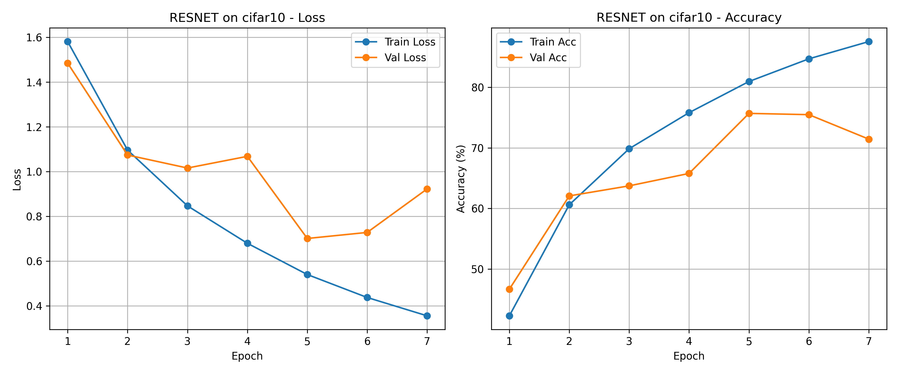 |
| **ConvNeXT** | 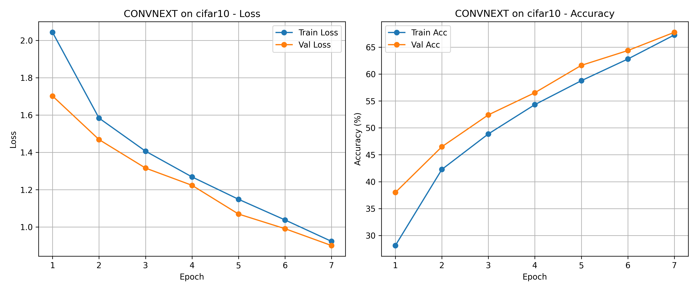 |
| **ViT** | 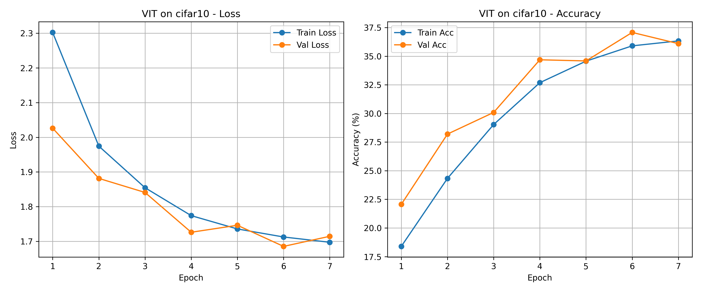 |

---

## 🧪 2. Validation Set Corruption & Peak Optimization
By changing purely the **validation target distribution** to noisy or randomized corruptions we establish varied robustness bounds.

**Crucial Finding:** The density and hierarchy complexity of datasets directly dictate optimal synthetic regularization boundaries. Rich datasets like **CIFAR-10** peak aggressively early (1 corruption condition). Simpler topological matrices (**FMNIST**) or exceptionally deep structural nodes (**ImageNet-100**) benefit highly from immense combinations of regularizing noise (e.g. peaking natively at 10 and 5 stacked corruptions, respectively) preventing immediate capacity crash.

### Optimization Mechanics across architectures:
| Dataset | Curve Comparison (Clean vs Corrupted) | Peak Optimization Limits (1-15 Mixes) | 
|---------|---------------------------------------|---------------------------------------|
| **CIFAR10** | 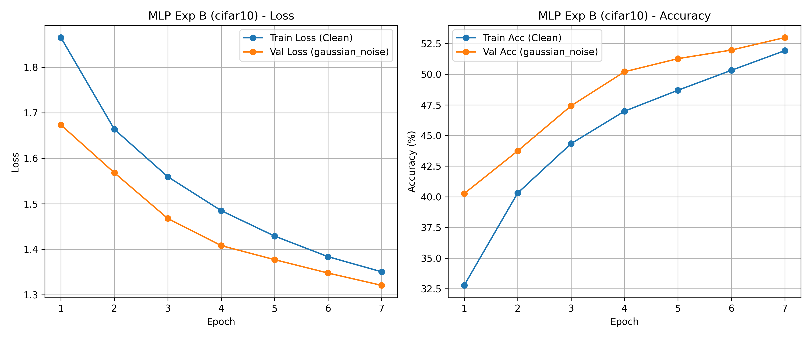 | 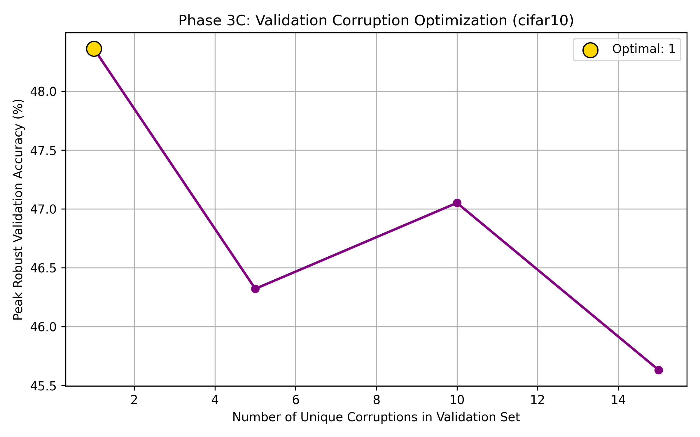 |
| **FMNIST** | 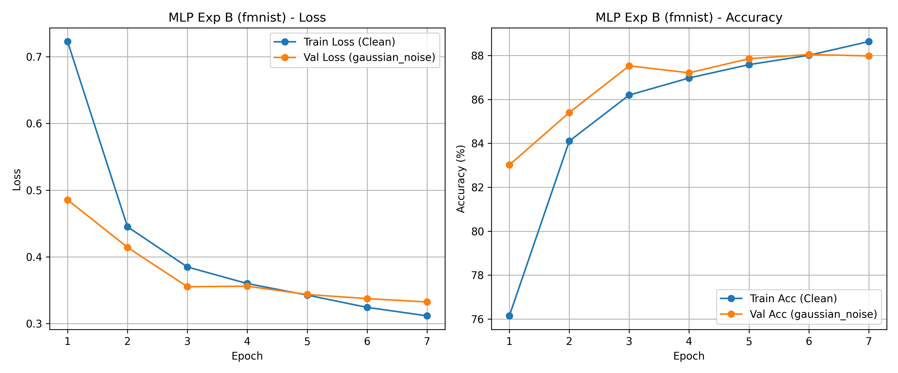 | 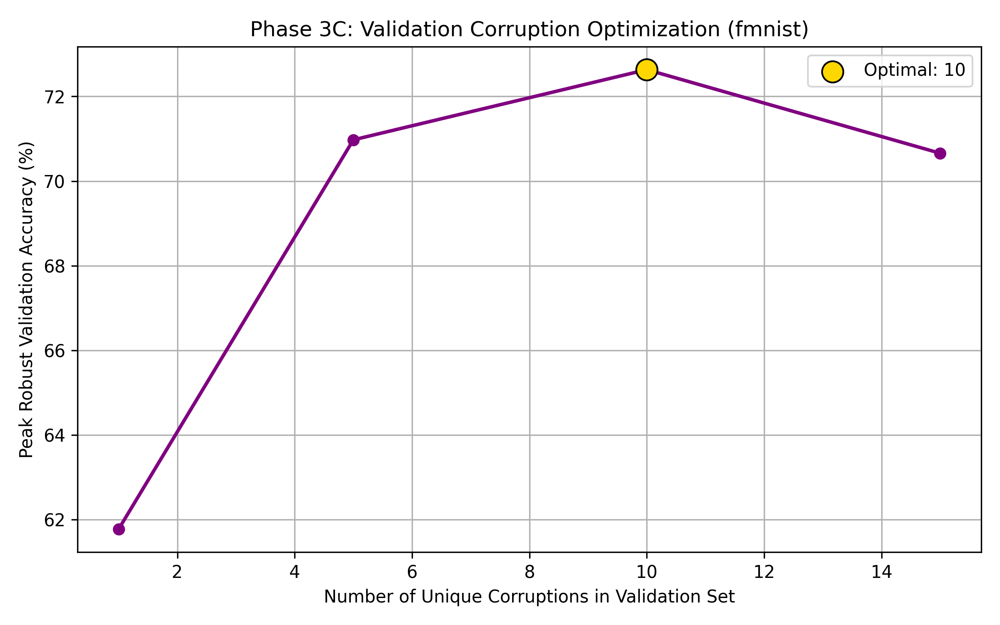 |
| **ImgNet100** | 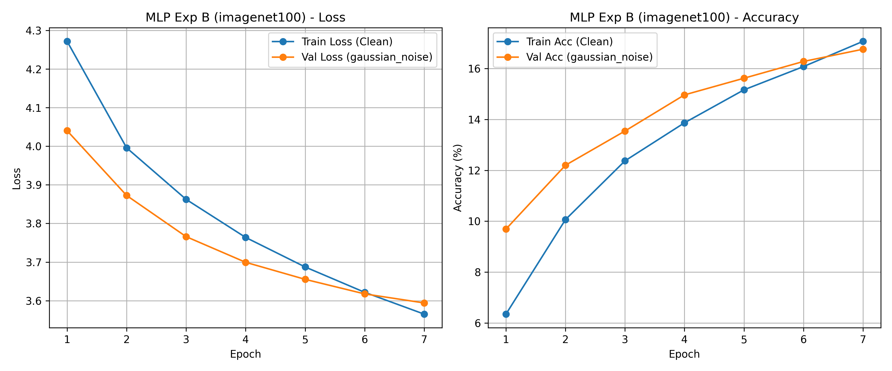 | 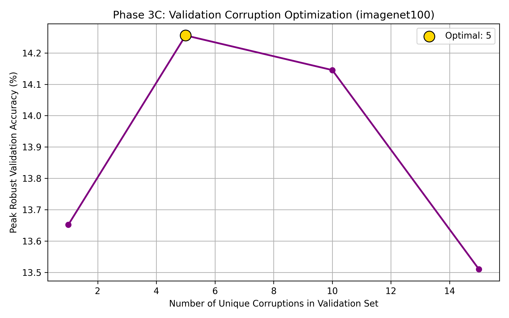 |

---

## 🗺️ 3. Decision Boundary Mapping & Topologies
Using Inverse PCA & heavily restricted 2D map clustering representations (via t-SNE) we can visibly observe exactly what regularizing noisy validations achieved vs natively clean parameters.  Models strictly tuned on pristine dataset parameters developed intensely fragile bounds. **Corrupted-Validation** mapping visually expanded class geometries buffering safely against displacement. 

| **Map Target** | **Decision Boundaries (PCA Limits)** | **t-SNE Embeddings** |
|-----------------|--------------------------------------|----------------------|
| **CIFAR10** | 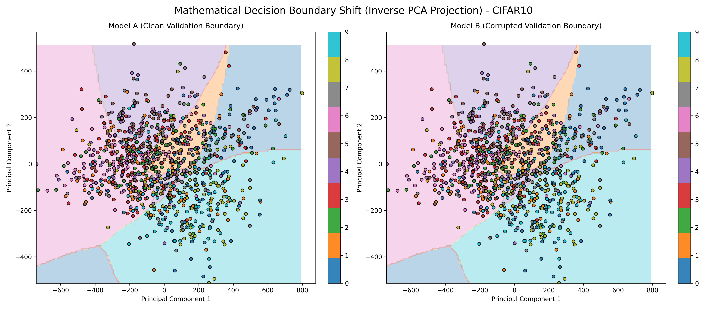 | 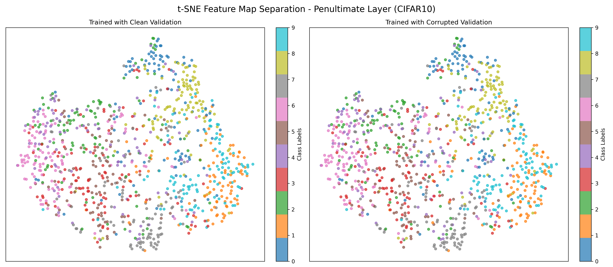 |
| **FMNIST** | 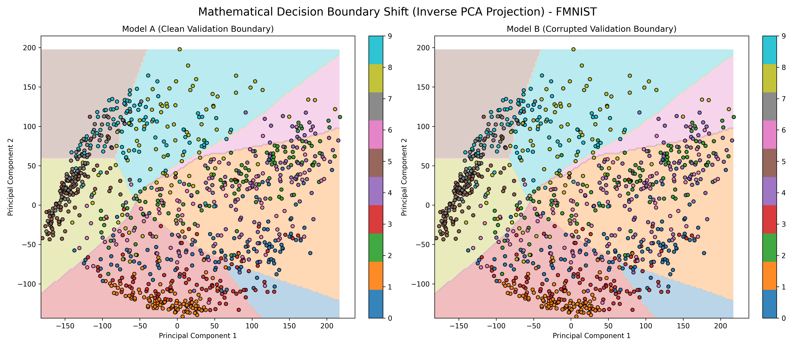 | 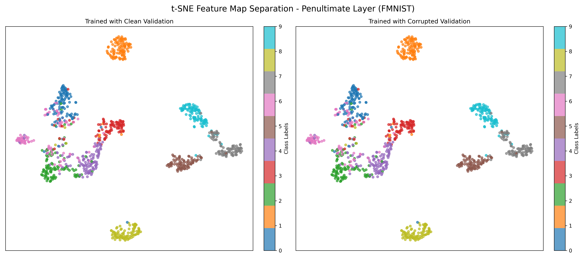 |
| **ImgNet100**| 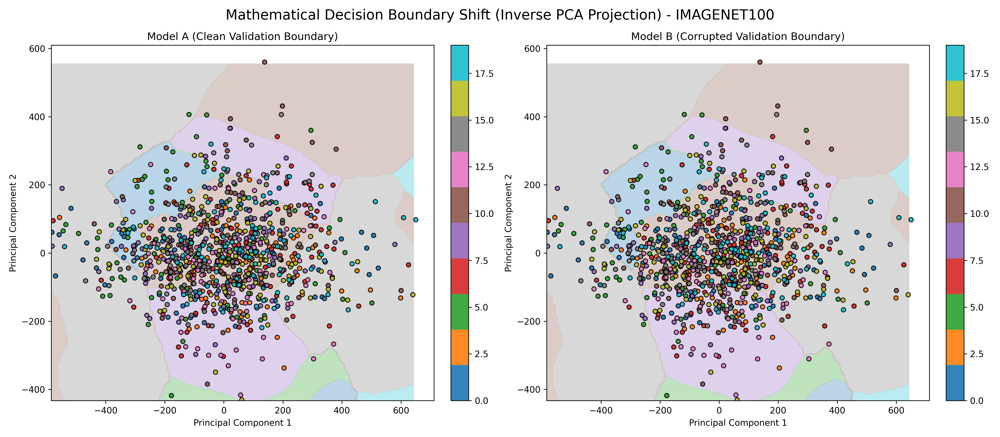 | 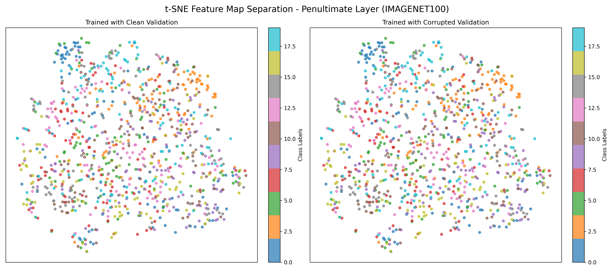 |

---

## ⚠️ 4. Internal Layer Interventions 
Finally, moving past environmental noise, we injected structural Gaussian parameters directly into inference tensors (`Early, Middle, Late`).
**Key Result:** Models exhibit severe localized sensitivity during preliminary edge acquisition blocks (early layers feature complete cascading network collapse). Meanwhile, late-stage parameter injection serves minimal performance impairment, acting practically akin to benign internal `Dropout`.

*Performance delta tracking layer-isolated collapse instances:*

| CIFAR10 | FMNIST | IMAGENET100 |
|---------|--------|-------------|
| 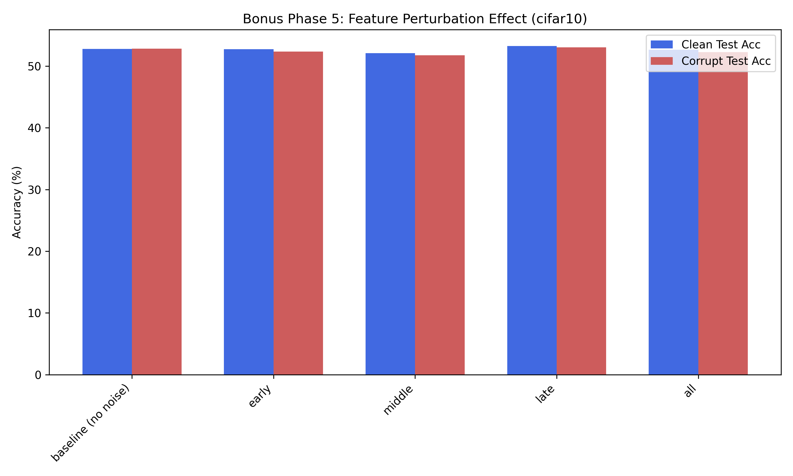 | 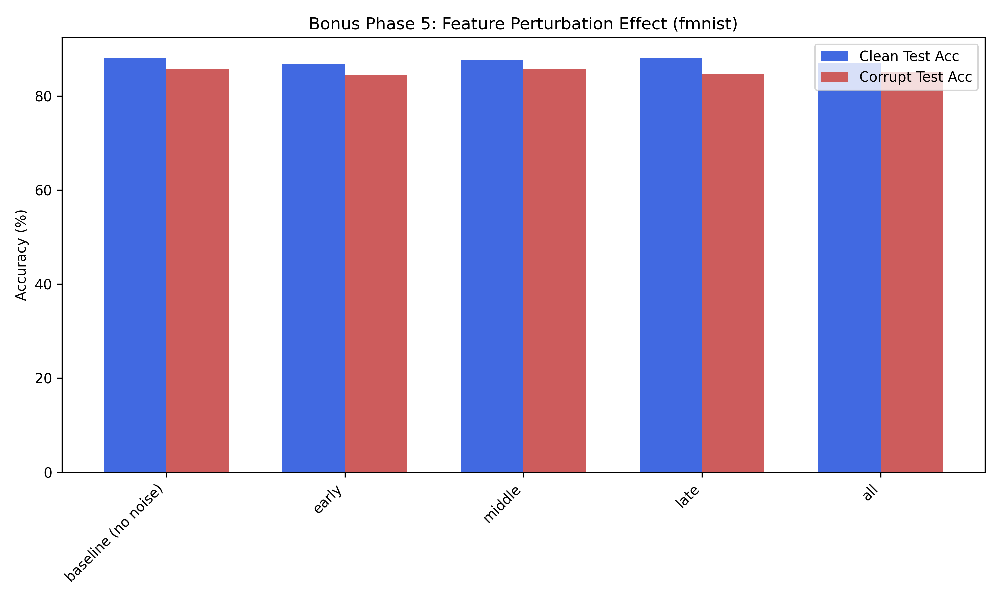 | 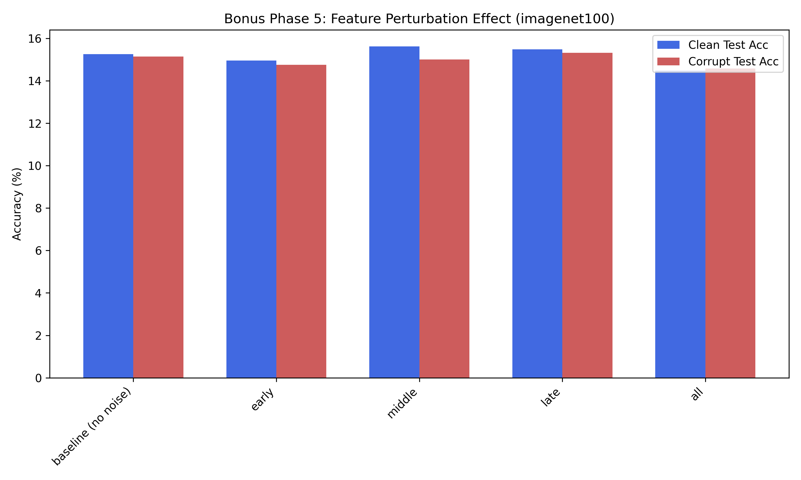 |

## 🏆 Conclusion
This analysis actively proved models such as mapping Multi-Head Attention blocks explicitly bypass local convolutions limits against Distribution shifts. Validating directly against complex structural corruption aggressively smooths topological manifolds and heavily decreases isolated overfitting, establishing much safer buffers against real-world displacement degradations!
